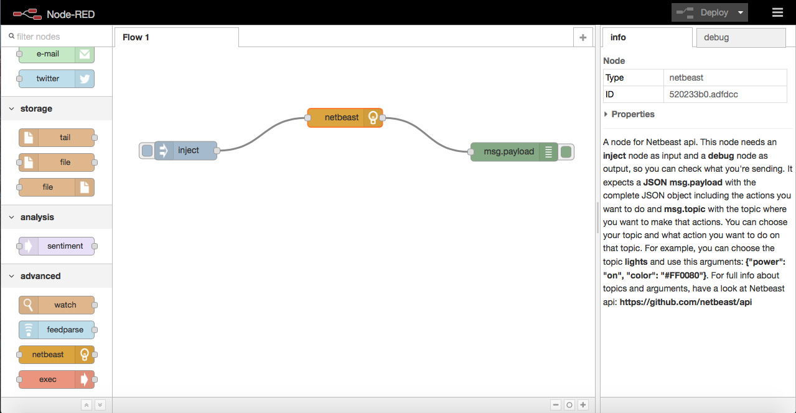
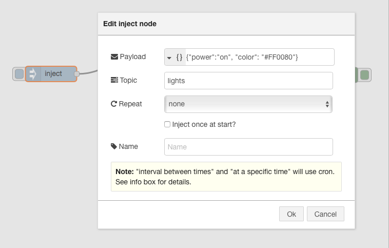

# Node-RED

http://nodered.org

Node-RED is a tool for wiring together hardware devices, APIs and online services in new and interesting ways.


Netbeast has included this tool as an application. So you can install that tool in the **Netbeast dashboard**. Also, you are able to install this tool in your device locally and create modules for it. 

If you want to know more about Node-red visit its [website](http://nodered.org) where you will find all the documentation available.

* [Install on the Netbeast Dashboard](#Dashboard)
* [Install Locally](#Local)

<a name="Dashboard">
## Netbeast Dashboard

Netbeast has included the [node-red tool](http://nodered.org) as an application for its dashboard. So, if you want to get it, you only need to access to the [market](http://market.netbeast.co/#/), download the application and install it on the **Dashboard**

If you want to know how to do this, go to this useful guide [netbeast docs](http://docs.netbeast.co)


<a name="Local">
## Local Installation

The purpose of the local installation is allow developers to create modules which will be on the node-red app for the **Netbeast dashboard**

### Download

Access to the [MarketPlace](https://market.netbeast.co/#/)

If you don't have an account, request an access. After that, log in and download the Netbeast-Red App.

Once you have downloaded the application, uncompress it.

Go to the source files directory through your terminal. Then type 
```
node red.js --port 3000
```

Node red will start running on port 3000. If you want to select another port change the --port Number

## Netbeast API module
We have added a new module to integrate the Netbeast api. It has been developed by Netbeast Team.

If you want to use this module, you only need to copy netbeast.html and netbeast.js files, that are located in the nodes directory, in your own nodes directory.

* Finally, start node-red and go to the browser. If all went fine, you will have a new module called "netbeast" and you will be able to configure node-red to control your devices using Netbeast.

Here you have the nodes you need to include with the "netbeast" one so it can work propertly.

And here you can see an example of what you should write in the inject node.


##CONTACT

Netbeast: http://netbeast.co / staff@netbeast.co

##REFERENCES

- [Netbeast](http://netbeast.co)
- [Node-Red](http://nodered.org)
